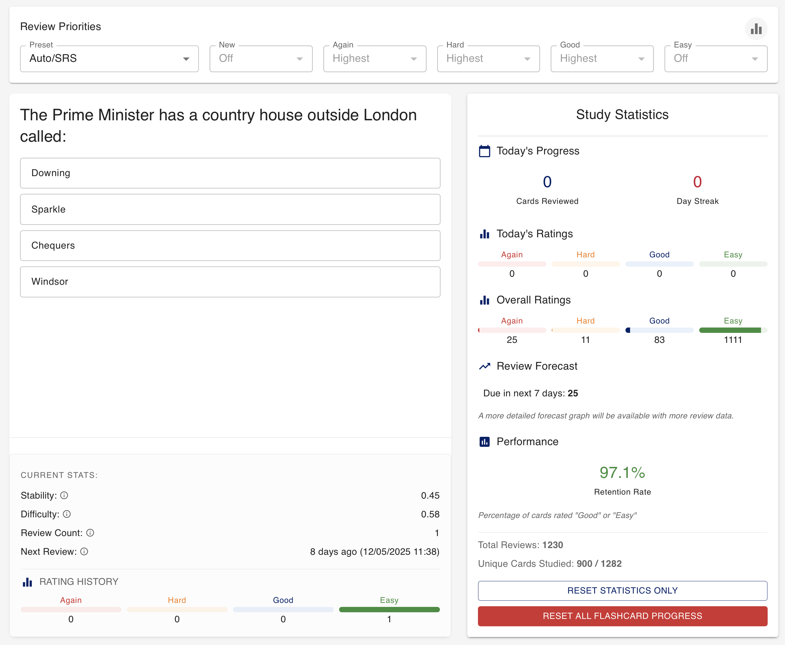

# Memorable Active Repetition Cards for Intelligent Navigation (originally Life in the UK Flashcards)

A flashcard application featuring spaced repetition using FSRS (Free Spaced Repetition Scheduler), custom scheduling and loads of stats for nerds. Originally developed to study for the Life in the UK test but could be used to study anything!  



## Features

- Flashcard review system with multiple-choice questions
- FSRS-based spaced repetition
- Clean, modern UI with Material-UI components
- Single-user support

## Docker

To build the Docker image, navigate to the root directory of the project (where the `Dockerfile` is located) and run:

```bash
docker build -t flashcard-app .
```

To run the Docker container after building the image:

```bash
docker run -p 3000:3000 -p 8000:8000 flashcard-app
```

This will start the application, and you should be able to access:
- Frontend: `http://localhost:3000`
- Backend API Docs: `http://localhost:8000/docs`

## Usage

1. Open your browser to `http://localhost:3000`
2. Review the flashcards presented to you
3. Select your answer
4. Rate your performance (1-4) after seeing the correct answer
5. The system will schedule the next review based on your rating

## Rating Scale

- 1: Complete blackout
- 2: Incorrect response, but the correct one remembered after seeing it
- 3: Correct response recalled with difficulty
- 4: Perfect response

## Where to get flashcards with questions

The app comes with a few example questions in the `questions.json` file to demonstrate how to format the file. For the Life in the UK test there are multiple sites out there which help you study for the test and have hundreds if not thousands of questions. All you need to do is to "convert" them to the appropriate format :wink: :wink: :nudge: :nudge:...